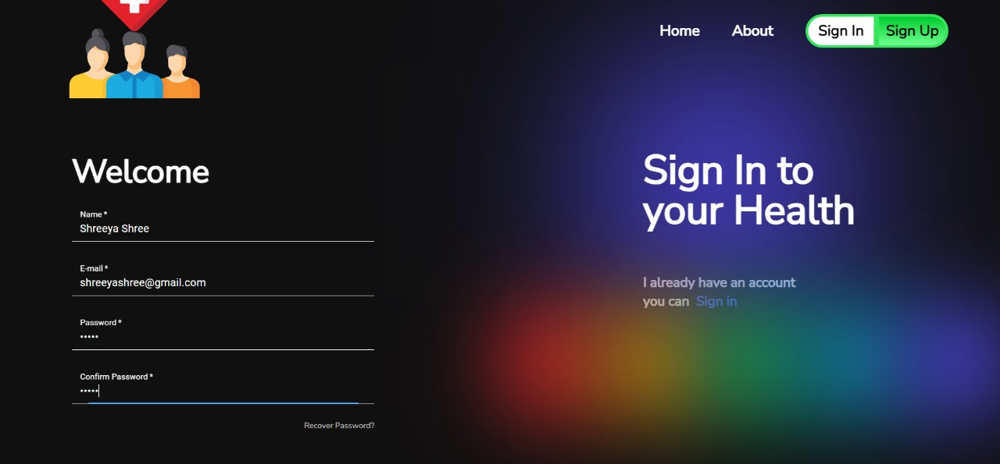
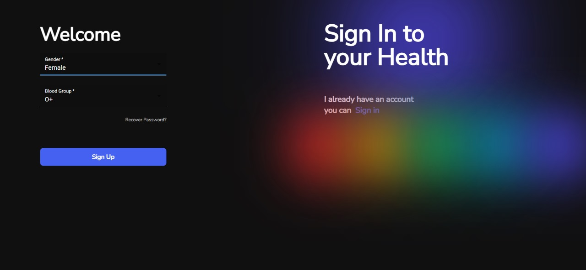
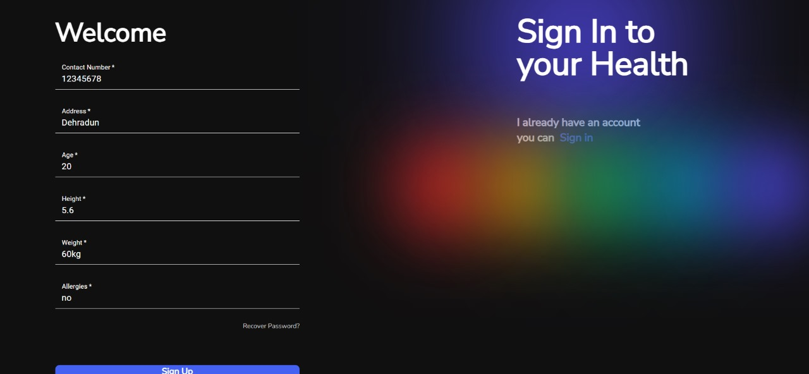
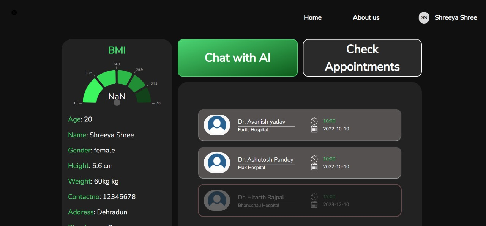
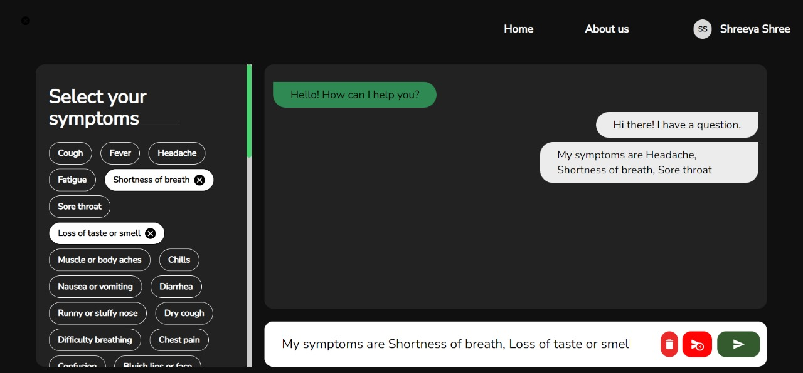
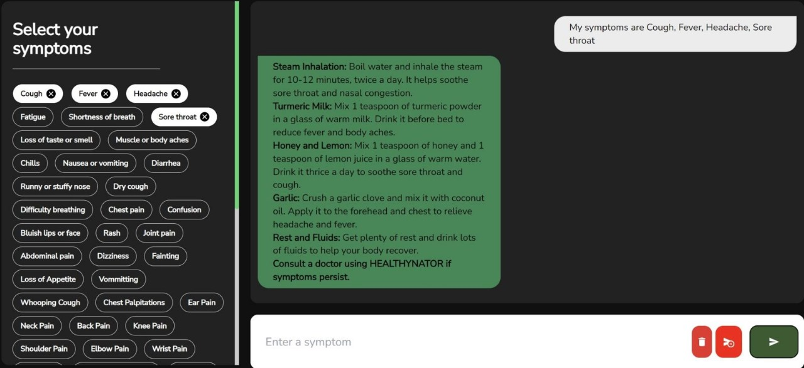
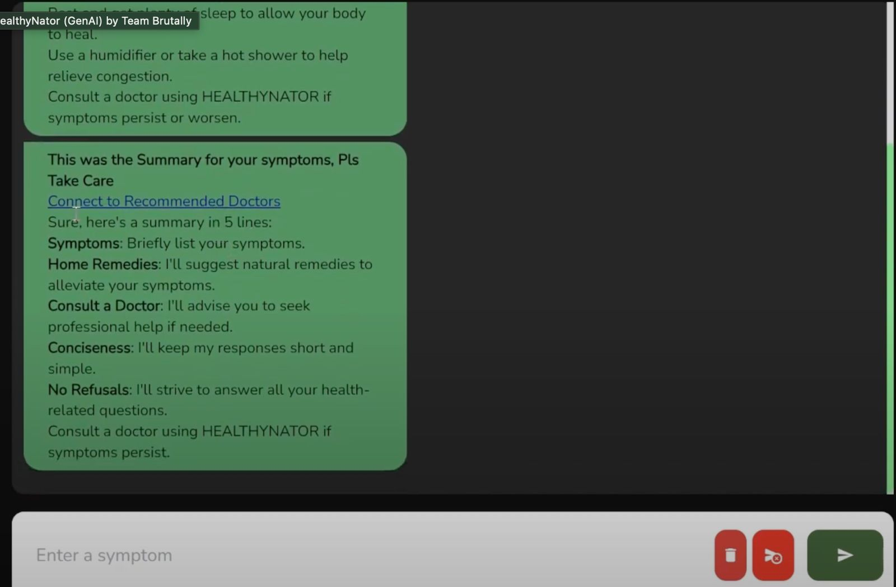

# Med-genie

Med-genie is a web application that allows patients to input their symptoms and receive home remedies or book an appointment with a healthcare professional based on the severity of their condition.

## Features

- **Symptom Checker**: Patients can input their symptoms, and the application will provide home remedies for minor ailments.
- **Appointment Booking**: For more severe cases, patients can book an appointment with a healthcare professional through the application.
- **Integration with Gemini API**: The application utilizes the Gemini API to access patient medical records and provide personalized recommendations.

## Technologies Used

### Frontend

- **React**: A JavaScript library for building user interfaces.
- **Vite**: A fast and lightweight build tool for modern web applications.

### Backend

- **Node.js**: A JavaScript runtime environment for server-side applications.
- **Express.js**: A minimal and flexible Node.js web application framework.
- **MongoDB**: A NoSQL database for storing application data.

## Getting Started

To run the application locally, follow these steps:

1. Clone the repository: `git clone https://github.com/your-username/med-genie.git`
2. Install dependencies for the frontend and backend:
   - Frontend: `cd med-genie/frontend && npm install`
   - Backend: `cd med-genie/backend && npm install`
3. Set up environment variables for the backend:
   - Create a `.env` file in the `backend` directory.
   - Add the required environment variables (e.g., MongoDB connection string, Gemini API credentials).
4. Start the development servers:
   - Frontend: `cd med-genie/frontend && npm run dev`
   - Backend: `cd med-genie/backend && npm start`
5. Open the application in your browser at `http://localhost:3000`.

## Demo Screenshots

## Thank You!!
